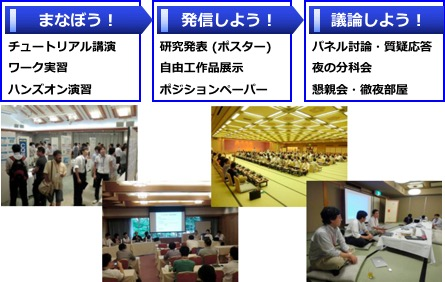

# SWESTとは

大学の研究者や学生、企業の技術者や管理者、その他、組込みシステムに関わる全ての人達が、徹底的に議論できる場を提供することを主な目的とした合宿型のワークショップです。

SWESTは、1999年より毎年夏に開催しており、これまで18回の開催で延べ約2,600名の皆様に参加いただきました。
2016年に開催したSWEST18は、『SWEST18きっぷ　～ああ、これだ、と思う技術がきっとある。～』をスローガンとして、 167名の参加をいただき、日本の組込み産業の将来像について活発な議論を行うことができました。

SWESTの目標を整理すると、次の通りになります。

* 現在の組込み業界の問題解決を促進
  * 技術者間における活発な議論の場を提供
  * 具体的な方法論を対象とした実効性の高いセッションを開催
* 大学と企業間における技術共有の促進
  * 大学における組込みシステムおよびその要素技術の研究の活性化
  * 企業における大学の研究成果の導入の促進
  * 具体的な方法論を対象とした実効性の高いセッションを開催
  * 企業の要求事項を大学側へ伝える場を提供
* 新たな活動のきっかけを提供
  * 産学共同の研究活動のきっかけを提供
  * 大学・企業間の人的交流の促進とそれによる創発的活動の場の提供

過去の開催記録はこちらのページにまとめてありますので、ご覧ください。

## 主催・共催・後援団体および協賛団体

* 主催: 組込みシステム技術に関するサマーワークショップ 実行委員会
* 共催
  * 一般社団法人 情報処理学会 組込みシステム研究会(SIGEMB)
  * 組込みシステム開発技術研究会(CEST)
  * NPO法人 組込みソフトウェア管理者・技術者育成研究会(SESSAME)
  * NPO法人 TOPPERSプロジェクト
* 後援 (一部依頼中)
  * 一般財団法人 日本科学技術連盟
  * 一般社団法人 組込みシステム技術協会(JASA)
  * 一般社団法人 情報処理学会 システムとLSIの設計技術研究会(SLDM)
  * 一般社団法人 電子情報通信学会
  * 下呂市コンベンションビューロー
  * ソフトウェア技術者協会（SEA）
  * システム開発文書品質研究会（ASDoQ）
  * NPO法人 軽量Rubyフォーラム
  * NPO法人 ソフトウェアテスト技術振興協会(ASTER)
  * 派生開発推進協議会(AFFORDD)
  * 車載組込みシステムフォーラム(ASIF)
* 協賛企業(口数順／五十音順)
  * アイシン・コムクルーズ株式会社
  * アーム株式会社
  * 株式会社アルファプロジェクト
  * 株式会社ヴィッツ
  * wolfSSL, Inc.
  * 株式会社永和システムマネジメント
  * APTJ株式会社
  * エプソンアヴァシス株式会社
  * 株式会社オーム社
  * キヤノンITソリューションズ株式会社
  * 京都マイクロコンピュータ株式会社
  * 株式会社システム計画研究所
  * 東海ソフト株式会社
  * 富士設備工業株式会社
  * 株式会社豆蔵
  * 菱電商事株式会社

(2017年8月9日現在)

SWEST実行委員会では、組込みシステム分野で活躍されている企業などに、SWESTへの協賛をお願いしています。組込みシステム業界全体の発展に寄与するというお気持ちでご協賛いただければ幸いです。

お申込み方法などの詳細は、こちらをご参照ください。

## 運営組織

※ 所属は2017年5月時点のものです。

五十音順で、◎はそれぞれの委員長をあらわしています。

* **ステアリング委員会**
  * 後藤 孝一 （ヴィッツ）
  * 後藤 文康 （アイシン・コムクルーズ）
  * 宿口 雅弘 （イーソルトリニティ）
  * 高瀬 英希 （京都大学）
  * ◎ 高田 広章 （名古屋大学）
  * 星野 利夫 （ヴィッツ）
  * 間瀬 順一 （APTJ）
* **ローカルアレンジメント委員会**
  * 青木 克憲 （名古屋大学）
  * 安藤 友樹 （SWEST実行委員会）
  * ◎ 後藤 孝一 （ヴィッツ）
  * 山本 椋太 （名古屋大学）
* **プログラム委員会**
  * 安積 卓也 （大阪大学）
  * 石郷岡 祐 （日立製作所）
  * 大川 猛  （宇都宮大学）
  * 小川 清  （名古屋市工業研究所）
  * 川口 晃  （アクティビティ・デザイン）
  * ◎ 高瀬 英希 （京都大学）
  * 月舘 統宙 （日立製作所）
  * 田中 和明 （九州工業大学）
  * 西 康晴  （電気通信大学）
  * 久住 憲嗣 （九州大学）
  * 畑 尚志  （SWEST実行委員会）
  * 松崎 浩幸 （三菱電機マイコン機器ソフトウエア）
  * 松原 豊  （名古屋大学）
  * 山科 祥悟 （三菱電機マイコン機器ソフトウエア）
  * 吉田 則裕 （名古屋大学）
* **スポンサーシップ委員会**
  *   大栄 豊  （デンソー）
  * 佐藤 洋介 （デンソー）
  * 武井 千春 （名古屋大学）
  * ◎ 間瀬 順一 （APTJ）
* **レジストレーション委員会**
  * 酒井 卓也 （SWEST実行委員会）
  * 芝 直之  （SWEST実行委員会）
  * 中里 大祐 （SWEST実行委員会）
  * ◎ 星野 利夫 （ヴィッツ）
  * 山崎 進  （北九州市立大学）
  * 山根 ゆりえ  （達人出版会）
* **パブリケーション委員会**
  * 尾鷲 幸代 （SWEST実行委員会）
  * ◎ 後藤 文康 （アイシン・コムクルーズ）
  * 鈴木 里沙 （SWEST実行委員会）
  * 吉田 充宏 （SCREENホールディングス）
* LED-Camp 実行委員会
  * 岩永 知裕 （福井工業大学）
  * 大栄 豊  （デンソー）
  * ◎ 岡山 直樹 （アイシン・コムクルーズ）
  * 桐畑 鷹輔 （島津エス・ディー）
  * 田口 直樹 （アフレル）
  * 土本 幸司 （LED-Camp実行委員会）
  * 星野 利夫 （ヴィッツ）
  * 細合 晋太郎  （チェンジビジョン）
  * 山科 和史 （日立製作所）
  * 山本 健太 （デンソークリエイト）

## SWEST事務局

SWEST へのお問い合わせは，

までメールにてご連絡ください。

SWEST実行委員会では、SWESTの運営にご協力くださる方を常時募集しています。実行委員会にご協力いただける方は、上記メールアドレスまでご連絡ください。
