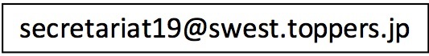

# 協賛のご案内

2018年8月30日(木)〜31日(金)に、第20回 組込みシステム技術に関するサマーワークショップ(SWEST20)を下呂温泉にて開催することとなりました。

SWESTは、1999年より毎年夏に開催しており、本年で20回目の開催となります。これまでのSWESTの開催状況は、下記ページをご参照ください。

[http://swest.toppers.jp/old-report](../old-report)

今年のSWESTも、益々盛り上げていく所存でございます。

なにとぞご高配賜りますようお願い申し上げます。いただきました協賛金は次代を担う学生達の参加支援のために使わせていただきたいと考えております。

組込みシステムは、日本が競争力を持つと言われる産業分野の多くで、基盤的な技術となっています。大学において組込みシステム（とりわけ、組込みソフトウェア）に関する研究に取り組んでいる例は増えつつありますが、産業界からの要求に十分に応えているとは言えません。さらに、企業間での技術交流も進んでいないのが現状です。

このような現状を打開する一つのステップとして、主として、組込みシステムに関連する研究を行っている大学の研究者や学生と、企業の技術者を集め、組込みシステム技術の進むべき方向性について議論することを目的とした「組込みシステム技術に関するサマーワークショップ（SWEST）」を開催しています。

SWEST実行委員会では、組込みシステムの分野で活躍されている企業などに、下記の要領でSWESTへの協賛をお願いしています。

* 協賛金: １口５万円
* 協賛のメリット
  * 貴社の社員の方は会員価格にてご参加いただけます。
  * SWESTホームページに、貴社名およびロゴを掲載します。
  * SWEST会場にて貴社の企業名・ロゴを掲げ、協賛いただいていることをアピールします。
  * 予稿集＆PP集の電子化に伴い、目次に貴社HPへのリンク（資料PDFも可）をつけさせていただきます。イメージとしてはサンプルページをご確認ください。
  * 2口以上ご協賛いただいた企業について、SWEST会場のセッションの合間に、貴社の広告をプロジェクタにてお流しします。
  * ワークショップのプレゼンセッションにて商用目的のデモブースを出展できます。商用デモを行われる場合には、可能な便宜を提供します。
  * ワークショップ会場にて、参加者全員を聴講対象としてショートプレゼン（30秒、2口以上のご協賛は1分）を実施していただけます。
  * 参加者にチラシを配布いたします。特に若手、学生向けの合宿勉強会LED-Campでは、リクルート目的のチラシも配布可能です。
* 協賛金の用途
  * 学生の参加費補助
  * ワークショップの内容を充実させる企画の実施
  * 若手、学生向けの合宿勉強会LED-Campの実施

組込みシステム業界全体の発展に寄与するというお気持ちでご協賛いただければ幸いです。

## お申込み方法

協賛いただける場合には、以下の申込書テンプレートをご利用頂き、必要事項をご記入の上、メールにて下記アドレス宛にお送り下さい。



折り返し、協賛金の振り込み方法、ロゴデータの取り扱い等についてご連絡差し上げます。

よろしくご検討の上、何卒協賛くださいますようお願い申し上げます。

## 申込書テンプレート

点線の間をコピーしてお使いください。

```
--------------------------------------------------------------
Subject: SWEST19 協賛申込

SWEST19協賛申込書

組込みシステム技術に関するサマーワークショップ（SWEST19）への協賛を
申し込みます。

会社名（プログラム等に掲載しますのでフルネームで正確にご記入下さい）:

　　　　　________________________________________________

協賛金額: ________________________

担当者住所: 
担当者所属: 
担当者名:
担当者メールアドレス：
電話番号: 

請求書の送付先が上記担当者と異なる場合には、経理担当者の連絡先を下に
ご記入ください。

経理担当者住所: 
経理担当者所属: 
経理担当者名: 
経理担当者メールアドレス：
電話番号: 

■会場内での商用デモについて　(該当するものを残してください)
　　・ 会場内で商用デモを行う
　　　　・ ワークショップ１日目のみ　　・両日 (該当するものを残してください)
　　　　※ デモに必要なもの(該当するものを残してください)：
　　　　　　　　　コンセント(　個)、長机、ポスター用スタンド
　　　　　　　　　その他（                                        ）
　　・ 会場内で商用デモを行わない

■会場内でのショートプレゼンについて (該当するものを残してください)
　　・　会場内でショートプレゼンを行う 協賛1口30秒／2口以上1分
　　・　会場内でショートプレゼンを行わない

■広告等のちらしの配布について　(該当するものを残してください)
　　・ SWEST参加者全員に同じちらしを配布
　　・ SWESTの社会人と学生の参加者で別のちらしを配布
　　・ LED-Camp参加者全員に同じちらしを配布
　　・ LED-Campの社会人と学生の参加者で別のちらしを配布
　　・ 配布希望無

--------------------------------------------------------------
```
