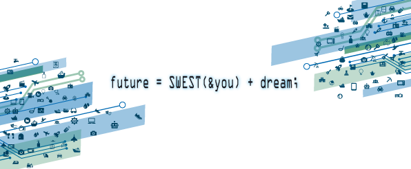

# SWEST20について

## SWEST20開催概要

* **開催日程: 2018年8月30日(木)〜31日(金)** (**20周年**を祝して8月29日(水)から**[特別企画](./wednesday)**を開催します！)
* **開催場所: [下呂温泉 水明館](https://www.suimeikan.co.jp) (岐阜県下呂市)**
* **メインテーマ:** `future = SWEST(&you) + dream;`

開催にあたり、[こちらの共催団体・協賛企業の皆さま](#org)より多大なるご理解・ご支援を頂いております。

今年は[情報処理学会組込みシステムシンポジウム2018](http://www.sigemb.jp/ESS/)と同時開催します。

## Topics (最新情報)

* 2018年5月08日: [SWEST20プログラム早期版](./SWEST20/program#early)を公開しました
* 2018年5月30日: [インタラクティブセッション発表募集](./interactive)の情報を掲載しました
* 2018年5月09日: [SWEST20特別企画(水曜)](./wednesday)の情報を公開しました
* 2018年5月08日: [SWEST20基調パネルセッション](./SWEST20/program#panel)の情報を公開しました
* 2018年5月08日: [SWEST20のちらし](./guide#flyer)を掲載しました
* 2018年5月07日: 討議テーマ・セッション提案の募集を締め切りました
* 2018年4月06日: [SWEST20協賛のご案内](./sponsor)を更新しました
* 2018年4月05日: [SWEST20の運営組織](./about#swest-org)を更新しました
* 2018年3月19日: ホームページをリニューアルしました

## 企画内容

**近日公開予定！**

<!--
## 参加申し込み

**近日公開予定！**
-->

<!--
## セッション募集・テーマ募集

**近日公開予定！**
-->

## ポジションペーパーの説明

ポジションペーパーは、SWESTへ参加するみなさんがSWESTでさらに議論を深めることを目的とする、意思表明文です。具体的には、SWESTへ参加するにあたって、SWESTのテーマ、各分科会テーマに対して、皆さんがどのような立場で、どのようにお考えになっているのかをまとめて表明していただくものです。

各分科会のテーマに類する問題をお持ちであるなら、是非ポジションペーパーにしたためてください。解決のお手伝いができるかもしれません。と言うものの、あまり堅苦しく考えずに「組込みシステム」に関わる話題について、ざっくばらんに書いていただければと思います。

詳しくは[参加申込み](regist/)に掲載する予定です。

## 主催・共催・後援団体および協賛団体

* 主催: 組込みシステム技術に関するサマーワークショップ 実行委員会

* 共催
  * [一般社団法人 情報処理学会 組込みシステム研究会(SIGEMB)](http://www.sigemb.jp/)
  * [組込みシステム開発技術研究会(CEST)](http://www.ertl.jp/CEST/)
  * [NPO法人 組込みソフトウェア管理者・技術者育成研究会(SESSAME)](http://www.sessame.jp/)
  * [NPO法人 TOPPERSプロジェクト](http://toppers.jp/)

* 後援 (一部依頼中)
  * [一般財団法人 日本科学技術連盟](http://www.juse.or.jp/)
  * [一般社団法人 組込みシステム技術協会(JASA)](http://www.jasa.or.jp/TOP/)
  * [一般社団法人 情報処理学会 システムとLSIの設計技術研究会(SLDM)](http://www.sig-sldm.org/)
  * [一般社団法人 電子情報通信学会](http://www.ieice.org/jpn/)
  * [下呂市コンベンションビューロー](http://hida-gero.jp/)
  * [ソフトウェア技術者協会（SEA）](http://sea.jp/)
  * [システム開発文書品質研究会（ASDoQ）](https://asdoq.jp/)
  * [NPO法人 軽量Rubyフォーラム](http://forum.mruby.org/)
  * [NPO法人 ソフトウェアテスト技術振興協会(ASTER)](http://aster.or.jp/)
  * [派生開発推進協議会(AFFORDD)](http://affordd.jp/)
  * [車載組込みシステムフォーラム(ASIF)](http://www.as-if.jp/)

* 協賛企業 (口数順／五十音順)
  * [アイシン・コムクルーズ株式会社](https://www.aisin-comcruise.com/)
  * [株式会社アルファプロジェクト](http://www.apnet.co.jp/)
  * [APTJ株式会社](http://www.aptj.co.jp/)
  * [エプソンアヴァシス株式会社](http://avasys.jp/)
  * [ダッソー・システムズ株式会社](https://www.3ds.com/ja/)

<!-- ロゴ画像 -->
<TABLE width="100%" style="width:100%; background-color:#ffffff; text-align:center; border-style:none;">
<!-- 
 -->
<TR style="border-style:none"><TD colspan=2 width="100%" style="border-style:none; text-align:center; ">

</TD></TR>

<!-- 2口協賛 -->
<!-- readme
widthは見た目の面積がだいたい同じになるように調整する
最大でも440pxとする
-->
<TR style="border-style:none"><TD colspan=2 width="100%" style="padding:8px 0 8px; border-style:none; text-align:center; ">

</TD></TR>
<TR style="border-style:none"><TD colspan=2 width="100%" style="border-style:none; text-align:center; ">

</TD></TR>
<TR style="border-style:none"><TD colspan=2 width="100%" style="padding:8px 0 8px; border-style:none; text-align:center; ">

</TD></TR>
<TR style="border-style:none"><TD colspan=2 width="100%" style="border-style:none; text-align:center; ">

</TD></TR>

<!-- 1口協賛 -->
<!-- readme
widthは見た目の面積がだいたい同じになるように調整する
最大でも200pxとする
-->
<TR style="border-style:none;">

<TR style="border-style:none;">
<TD width="50%" style="padding:8px 0 8px; border-style:none; text-align:center;">

</TD>
<TD width="50%" style="padding:8px 0 8px; border-style:none; text-align:center;">

</TD>

</TR><TR style="border-style:none">
<TD width="50%" style="border-style:none; text-align:center;"></TD>
<TD width="50%" style="border-style:none; text-align:center;"></TD>
</TR>

<TR style="border-style:none;">
<TD width="50%" style="padding:8px 0 8px; border-style:none; text-align:center;">

</TD>
<TD width="50%" style="padding:8px 0 8px; border-style:none; text-align:center;">
</TD>

</TR><TR style="border-style:none">
<TD width="50%" style="border-style:none; text-align:center;"></TD>
</TR>

</TR>
</TABLE>

(2018年5月7日現在)

SWEST実行委員会では、組込みシステム分野で活躍されている企業などに、SWESTへの協賛をお願いしています。組込みシステム業界全体の発展に寄与するというお気持ちでご協賛いただければ幸いです。

お申込み方法などの詳細は、[こちら](../sponsor)をご参照ください。

